A real-time data warehouse pipeline ingesting event streams from multiple sources and making them available for analytics and search.

```mermaid
architecture-beta
  group sources[Source Systems]
  group pipeline[Kafka Pipeline]
  group sinks[Sink Layer]

  service txdb(logos:postgresql)[Transactional DB] in sources
  service debezium[Debezium CDC] in pipeline
  service kafka(logos:kafka)[Apache Kafka] in pipeline
  service schema[Schema Registry] in pipeline
  service connect(logos:kafka)[Kafka Connect] in pipeline
  service es(logos:elasticsearch)[Elasticsearch] in sinks
  service pgdw(logos:postgresql)[Analytics DB] in sinks

  txdb:R --> L:debezium
  debezium:R --> L:kafka
  kafka:T --> B:schema
  kafka:R --> L:connect
  connect:R --> L:es
  connect:B --> T:pgdw
```

**Tech Stack:** Apache Kafka, Kafka Connect, Elasticsearch, PostgreSQL, Debezium

**Key features:**

- Kafka Connect source connectors to ingest data from transactional databases via Debezium CDC (Change Data Capture)
- Sink connectors to stream data into Elasticsearch for full-text search and analytics dashboards
- PostgreSQL as the serving layer for structured analytical queries
- Schema registry integration for enforcing Avro schemas across producers and consumers
- Fault-tolerant design with dead-letter queues and offset management for at-least-once delivery guarantees
