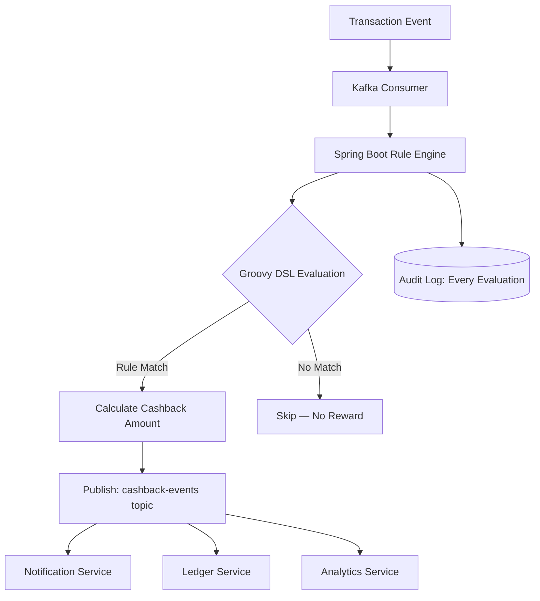

A flexible, business-configurable rule engine that evaluates transaction events in real time to determine cashback eligibility and amounts without requiring code deployments for rule changes.

**Tech Stack:** Groovy, Apache Kafka, Java, Spring Boot

**Key features:**

- Domain-Specific Language (DSL) in Groovy allowing business teams to author cashback rules without engineering involvement
- Rules are loaded dynamically at runtime — no redeployment needed when business rules change
- Kafka event stream consumer processes transaction events as they occur for sub-second cashback determination
- Rule evaluation results published back to Kafka for downstream services (notification, ledger, analytics)
- Audit logging of every rule evaluation for compliance and debugging
