A scalable, serverless quiz system designed to handle nationwide concurrent users, built entirely on AWS managed services.

```mermaid
architecture-beta
  group client[Client]
  group cdn[CDN]
  group api[API Layer]
  group compute[Compute]
  group data[Data Layer]

  service browser(logos:chrome)[Browser] in client
  service cloudfront(logos:aws-cloudfront)[CloudFront] in cdn
  service s3(logos:aws-s3)[S3 Static Assets] in cdn
  service apigw(logos:aws-api-gateway)[API Gateway] in api
  service lambda(logos:aws-lambda)[Lambda] in compute
  service dynamo(logos:aws-dynamodb)[DynamoDB] in data
  service redis(logos:redis)[ElastiCache Redis] in data

  browser:R --> L:cloudfront
  cloudfront:B --> T:s3
  browser:R --> L:apigw
  apigw:R --> L:lambda
  lambda:R --> L:dynamo
  lambda:B --> T:redis
```

**Tech Stack:** AWS S3, Lambda, DynamoDB, Redis (ElastiCache), API Gateway

**Key features:**

- Serverless architecture using AWS Lambda for quiz logic — zero server management
- DynamoDB for low-latency question/answer storage with on-demand capacity scaling
- Redis (ElastiCache) for session caching and leaderboard scoring to reduce database load
- Static frontend assets served via S3 + CloudFront CDN for fast delivery across regions
- API Gateway for routing and rate-limiting at scale
