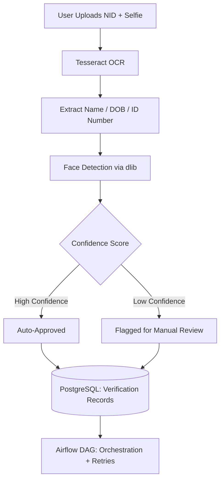

An automated identity verification pipeline that extracts information from National ID (NID) cards using OCR and cross-validates it with a live selfie using facial recognition.

**Tech Stack:** Python, Tesseract OCR, face_recognition (dlib), Apache Airflow, PostgreSQL

**Key features:**

- Document scanning via Tesseract OCR to extract name, date of birth, and ID number from NID images
- Facial similarity comparison using `face_recognition` (dlib-based) between NID photo and user selfie
- Apache Airflow DAGs to orchestrate the end-to-end verification workflow with retry logic and alerting
- Confidence scoring to flag edge cases for manual review
- Reduced manual verification workload significantly by automating the majority of standard cases
